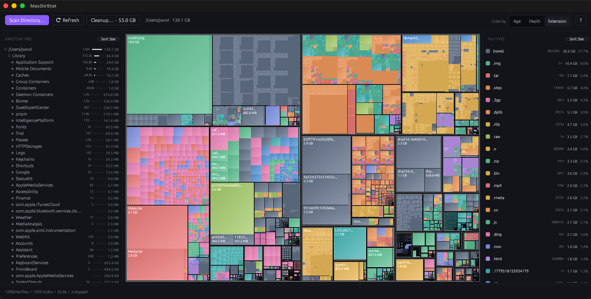

# mac-dir-stat

Treemap directory-size visualizer for macOS. Rust + [egui](https://github.com/emilk/egui).



## Features

- **Treemap rendering** of directory contents — area = file size — with cushioned gradient colors per file type, depth, or modification age.
- **Directory tree panel** synced to the treemap; click anywhere in the treemap to reveal the location. Each folder shows its size, a percentage bar, and its **item count** (files + subdirs). Cycle the sort between **Size · Name · Items · Recent**, and navigate the whole list from the keyboard.
- **File-type breakdown** showing total bytes, percentage, and **file count** per extension; sort by **Size · Count · Name**; click a row to dim non-matching files.
- **Cleanup Suggestions** with multi-select and batch trash: scans for known-regenerable directories (Xcode DerivedData / Archives / Simulators / DeviceSupport, `node_modules`, `target`, Application Caches, Docker / Cargo / rustup / Gradle / Maven / Next.js / Turbo, …). Tick the candidates you trust, hit one button, confirm once. Empty Trash from the same window when you're done.
- **Refresh subtree**: right-click a folder (or `⇧⌘R` on a selected one) to re-scan only that subtree without losing your current view.
- **Right-click menu** on every node — **Open**, Reveal in Finder, **Open Terminal Here**, **Get Info**, Copy Path, Refresh, Zoom Into, Move to Trash.
- **Free & unknown space** — scanning any volume root (`/` or a mounted volume under `/Volumes`) adds `<Free Space>` and `<Hidden / Skipped>` blocks so the treemap accounts for the whole disk.
- **Drag-and-drop** a folder onto the window to scan it.
- **Hover tooltip** with name, full path, size, type, and relative modified time.
- **Scans on launch** — opens straight into a scan of your whole disk (or your last-scanned folder), no welcome screen to click through.
- **One-time Full Disk Access prompt** — on first run, if the app lacks Full Disk Access, it offers to open the right Settings pane once (and never nags again); protected areas otherwise show up as `<Hidden / Skipped>`.
- **Persistent state** — last scan path, color mode, and window size are restored on launch.
- **Live scan progress** — counts, bytes, current path, and skipped-error count surfaced as the walker progresses.
- **Freed-this-session counter** in the status bar — accumulates bytes trashed since the last scan started.
- **TCC-aware**: known protected paths (Photos library, Mail, Calendar, Reminders, removable volumes, …) are filtered out before traversal so you don't get a wall of macOS permission prompts on first scan.

Press `?` at any time for the keyboard shortcut list.

### Privacy

MacDirStat can send **anonymous, cookieless** usage counts (app opens, scans run, space reclaimed — never file names or paths) to help prioritize features. It is **off by default** unless a release build is configured with an analytics endpoint, and you can always turn it off under **Help → Privacy**, with `MACDIRSTAT_NO_TELEMETRY=1`, or by leaving the build unconfigured.

## Compared to

| | MacDirStat | [DaisyDisk](https://daisydiskapp.com) | [GrandPerspective](https://grandperspectiv.sourceforge.net) | [WinDirStat](https://windirstat.net) |
|---|---|---|---|---|
| Platform | macOS | macOS | macOS | Windows |
| Price | **Free** | Paid | Free (donations) | Free |
| Open source | **Yes (MIT)** | No | Yes (GPL) | Yes |
| Visualization | Treemap | Sunburst | Treemap | Treemap |
| Folder list + file-type list | **Yes** | No | No | Yes |
| One-click cleanup of regenerable junk | **Yes** | No | No | No |
| Actively developed | **Yes** | Yes | Sporadic | Yes |

If you loved WinDirStat on Windows and want the same thing on a Mac — free and
open-source — that's what this is.

## Install

### Homebrew (recommended)

```sh
brew install --cask chartres/mac-dir-stat/mac-dir-stat
```

### Manual DMG

Grab the latest `MacDirStat-<version>.dmg` from [Releases](https://github.com/Chartres/mac-dir-stat/releases), open it, drag **MacDirStat** into `/Applications`.

The app is **signed with a Developer ID and notarized by Apple**, so it opens normally on first launch — no Gatekeeper workaround needed.

## Keyboard shortcuts

| Shortcut | Action |
|---|---|
| `⌘O` | Pick directory to scan |
| `⌘R` | Re-scan current root |
| `⇧⌘R` | Re-scan only the selected subtree |
| `⌘1` / `⌘2` / `⌘3` | Color treemap by extension / depth / modified age |
| `⌘F` | Search files in scanned tree |
| `↑` / `↓` | Move selection up/down the directory list |
| `→` / `←` | Expand / collapse the selected directory |
| `⌘⌫` | Move selected node to Trash |
| `↩` | Reveal selected node in Finder |
| `Esc` | Close help/cleanup/search · pop zoom · clear selection |
| `?` | Toggle help / about window |

## Build from source

```sh
cargo run --release
```

Build a universal `.app` + DMG:

```sh
./scripts/bundle.sh   # produces dist/MacDirStat.app
./scripts/dmg.sh      # produces dist/MacDirStat-<version>.dmg
```

Tag-driven release: pushing `vX.Y.Z` triggers `.github/workflows/release.yml`, which builds a universal DMG and publishes it to GitHub Releases.

## Architecture

- `src/scanner/` — parallel filesystem walk via [jwalk](https://github.com/byron/jwalk), TCC-protected paths filtered up front.
- `src/treemap/` — squarified treemap layout, color gradients, palette.
- `src/ui/` — egui chrome: toolbar, side panels, treemap viewport, search, cleanup window, context menu.
- `src/cleanup.rs` — heuristic detection of regenerable directories.
- `src/state.rs` — persisted UI state (scan root, color mode).
- `src/flywheel.rs` — optional anonymous usage analytics (off by default; see [Privacy](#privacy)).
